# Monitoring Performance

**Windows & Linux Administration Guide**

---

## Overview

A performance monitor measures the utilization of system resources — CPU, memory, storage, and networking. Establishing a baseline when a server is first deployed, upgraded, or repurposed provides a reference point against which subsequent monitoring can detect degraded performance.

In environments where typical usage patterns are unavailable — such as development or test environments — monitoring can be conducted using a synthetic load tool (e.g., HeavyLoad) to simulate realistic demand.

This guide covers three interconnected tools available on Windows:

- **Task Manager** — quick, real-time overview of CPU and memory utilization.
- **Resource Monitor** — per-process resource detail for deeper analysis.
- **Performance Monitor** — time-series data collection for trend and capacity planning.

It also covers key command-line and web-based utilities for performance monitoring on Linux.

---

# Part 1: Monitoring Performance in Windows

## Section 1: Monitor Performance in Task Manager

Task Manager provides an at-a-glance view of CPU, memory, disk, and network utilization. The Performance tab is the primary area of interest when diagnosing resource pressure.

**Steps:**

1. **Open Task Manager.** Right-click **Start** and select **Task Manager**. Click **More details**, then open the **Performance** tab.

   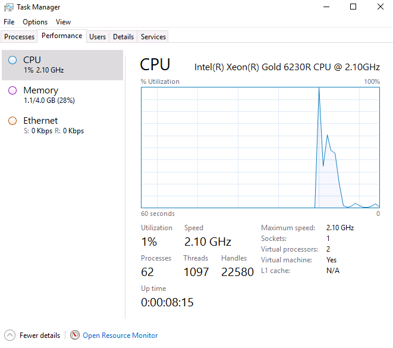

2. **Launch HeavyLoad.** Open the HeavyLoad shortcut from the desktop.

   > **Note:** HeavyLoad is a freeware stress-testing tool developed by JAM Software (<https://www.jam-software.com/heavyload>).

   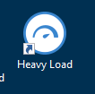

3. **Arrange windows.** Position Task Manager and HeavyLoad side by side so both are visible simultaneously.

4. **Configure the test.** In HeavyLoad, use the toolbar or the **Test Options** menu to enable only the **CPU** and **Memory** tests.

   > ⚠️ **Warning:** Do not enable the GPU test. If it runs by mistake, restart the virtual machine to recover.

   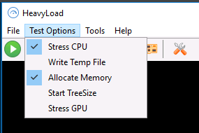

5. **Start the test.** Click the toolbar button or select **File > Start Selected Tests**.

6. **Dismiss the virtual machine prompt.** Check **Do not show again** and click **Continue**.

   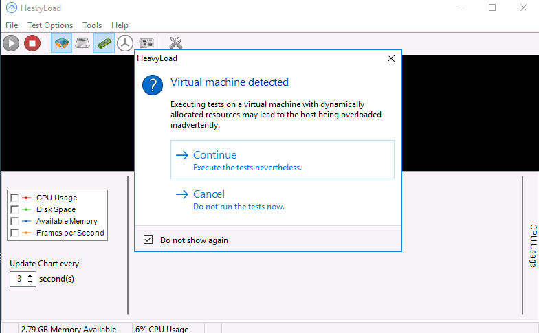

7. **Observe CPU utilization.** In Task Manager, watch the CPU graph rise to 100%. Review the supplementary statistics:

   - **Processes:** executable images running as services or desktop applications.
   - **Threads:** execution units managed by a process that enable parallel operations. For example, a web server uses multiple threads to handle simultaneous client connections.
   - **Handles:** resources accessed by threads, such as file system objects or network sockets.

   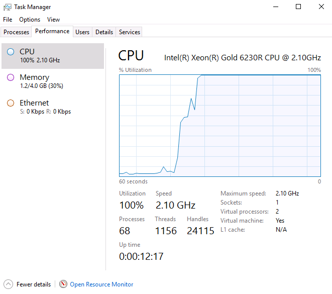

8. **Note system uptime.** Total system uptime is displayed on the CPU page of the Performance tab.

9. **Observe memory consumption.** Select the **Memory** node and watch available memory decrease. Review the key memory metrics:

   - **Committed:** overall virtual memory usage. The first value is the total in-use memory (RAM + paged), and the second is the maximum virtual memory capacity (RAM + pagefile size).
   - **Cached:** memory reserved to accelerate file access by holding frequently requested objects in RAM.

   Windows actively uses available memory for caching. High physical memory usage combined with a large cache and low pagefile usage generally indicates adequate RAM. Conversely, low cache and high pagefile usage indicates memory pressure.

   > The test simulates a memory leak or ever-increasing workload, where processes continuously claim memory without releasing it. As physical RAM is exhausted, the operating system pages data to disk, causing measurable performance degradation.

   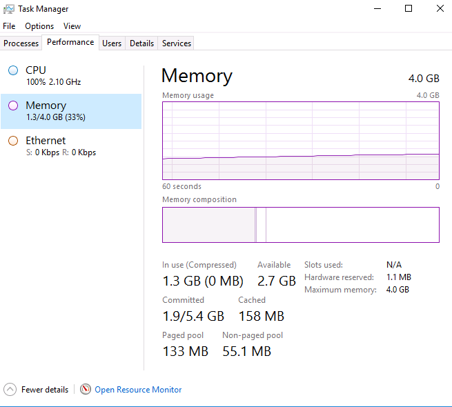

   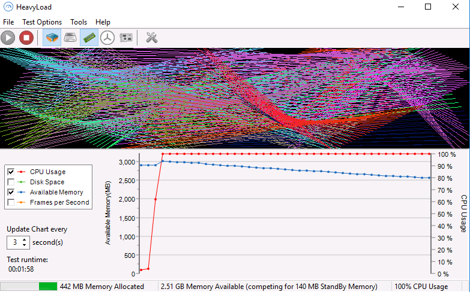

10. **Stop the test.** Click **Stop** in HeavyLoad. Observe all metrics return toward baseline.

    > **Note:** In an isolated lab environment, the baseline load is near zero (essentially idle). In production, the baseline reflects the server's normal steady-state utilization.

    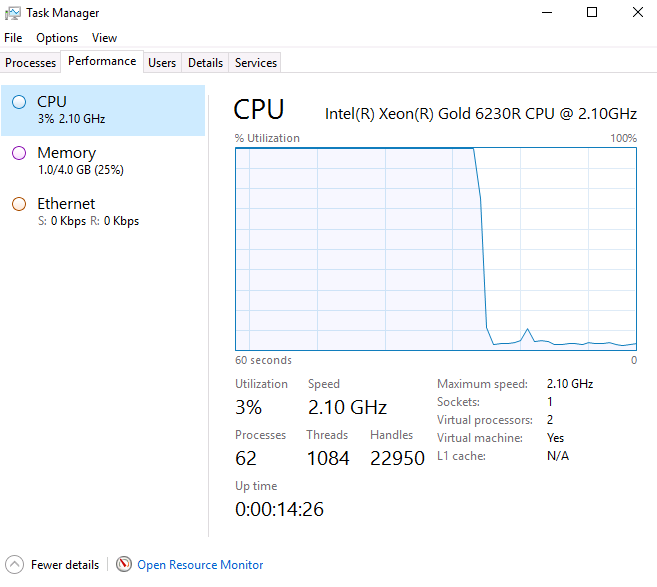

11. **Leave both windows open.**

---

## Section 2: Monitor Performance in Resource Monitor

While Task Manager provides high-level metrics, Resource Monitor breaks down resource consumption at the individual process level, making it useful for identifying which processes are responsible for utilization spikes.

**Steps:**

1. **Open Resource Monitor.** In Task Manager, select the **Resource Monitor** link at the bottom of the Performance tab. You may close Task Manager if preferred.

   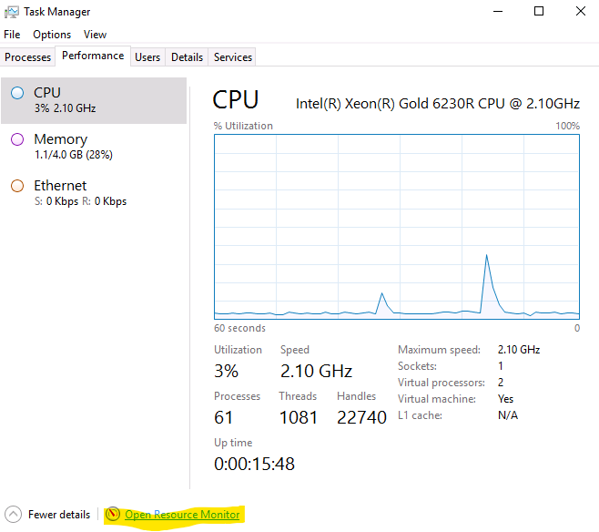

   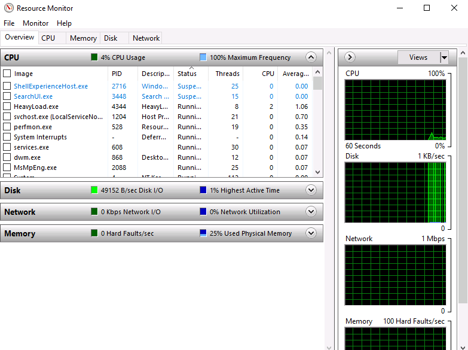

2. **Reconfigure HeavyLoad.** Disable the **Stress CPU** test and enable the **Write Temp File** test.

3. **Adjust test settings.** Select **Tools > Options** and configure the following:

   - **Memory tab:** Set Threshold to **500 MB** and Intensity to **500 MB/s**.

     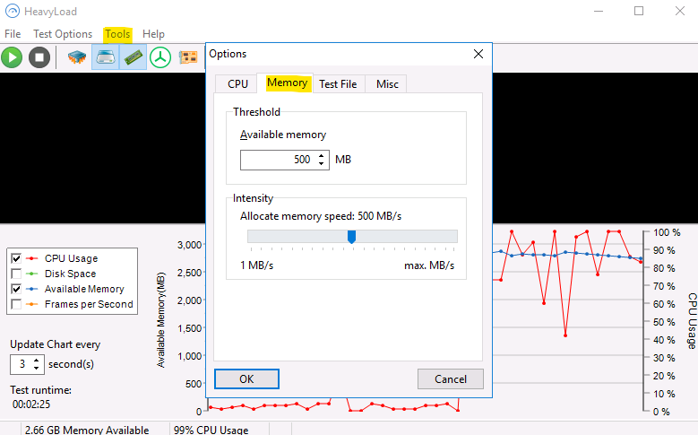

   - **Test File tab:** Set Free Space to **5000 MB** and writing speed to **500 MB/s**.

     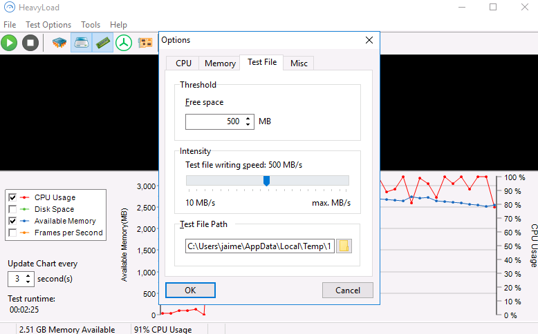

4. **Click OK.**

5. **Start the test and observe the Overview tab** in Resource Monitor.

   > **Note:** Even without the CPU stress test enabled, CPU utilization typically reaches 40–50% due to the I/O workload.

   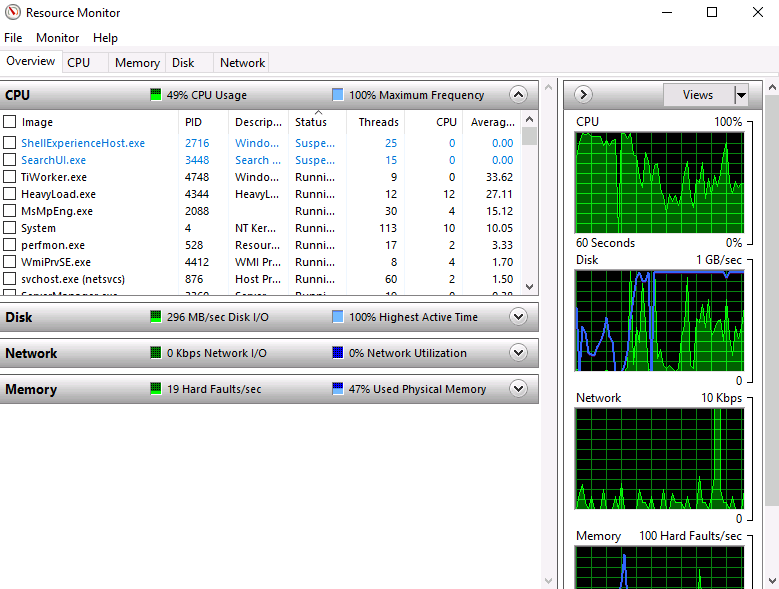

6. **Examine memory in detail.** Select the **Memory** tab. Observe that the **Hard Faults** count (pagefile activity) is increasing.

7. **Sort by Hard Faults.** In the Processes pane, click the **Hard Faults** column header to sort descending.

8. **Open a test application** (e.g., Firefox). Observe that the application generates hard faults, as the test suite is denying it available memory.

   > **Note:** Desktop applications such as browsers should not be run on production servers. This step is included only for lab convenience.

9. **Pin the process.** Under Processes, check the checkbox next to the application's process to keep it at the top. Observe that the process remains in memory briefly before being released due to insufficient free RAM.

   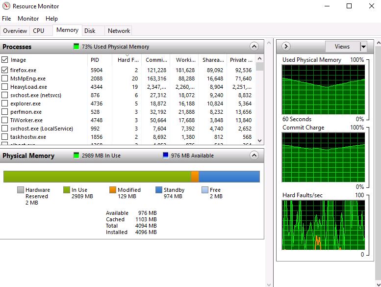

10. **Review disk activity.** Select the **Disk** tab. Under Storage, note the available disk space.

    > **Note:** If available space is below 5000 MB, the Write Temp File test may have already stopped automatically.

    The charts compare current active time against the historical peak. Pay particular attention to **disk queue length**, which should not exceed twice the number of physical disks serving the volume:

    - Single disk: queue length should remain **below 2**.
    - 3-disk RAID volume: queue length should remain **below 6**.

    Elevated disk queue length can result from both file system/database activity and from pagefile usage under memory pressure.

    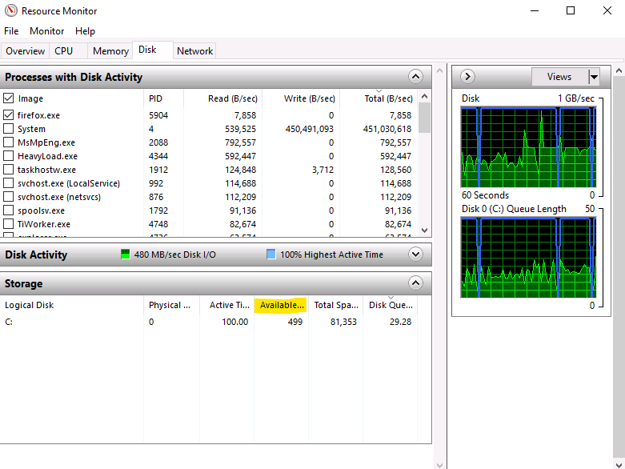

11. **Stop the test.** Click **Stop** in HeavyLoad and confirm that all metrics return to baseline. Close Resource Monitor and Task Manager. Leave HeavyLoad open.

---

## Section 3: Configure Performance Monitor

While Task Manager and Resource Monitor offer real-time snapshots, Performance Monitor is designed for sustained data collection. It records counter values over time, enabling retrospective analysis of load events and long-term capacity planning.

**Steps:**

1. **Open Performance Monitor.** Select **Start > Windows Administrative Tools > Performance Monitor**.

2. **Create a new Data Collector Set.** Expand **Data Collector Sets > User Defined**. Right-click **User Defined** and select **New > Data Collector Set**.

   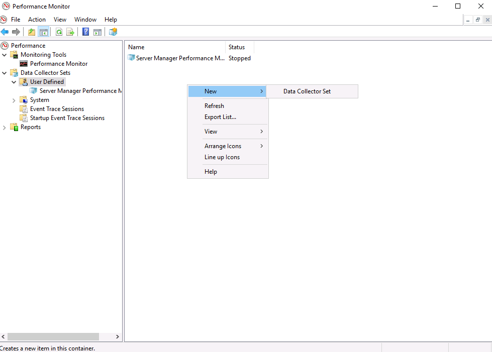

3. **Name the set.** Enter the name **Baseline**, select **Create manually**, and click **Next**.

4. **Select data log type.** With **Create data logs** selected, check the **Performance counter** checkbox and click **Next**.

   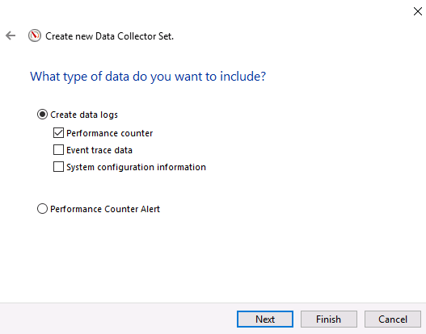

5. **Add performance counters.** Click the **Add** button and add each of the following counters:

   - `Processor > % Processor Time (_Total)`
   - `Memory > Available Bytes`
   - `Memory > Page Faults/sec`
   - `LogicalDisk > Avg. Disk Queue Length (_Total)`
   - `LogicalDisk > % Free Space (_Total)`

6. **Finish the wizard.** Click **OK**, then click **Finish**.

   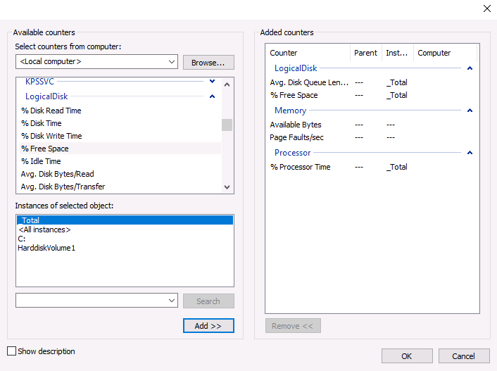

7. **Start recording.** Right-click **Baseline** and select **Start**.

8. **Generate baseline activity.** Perform representative administrative tasks, such as viewing the Event Log, exporting log items, or restarting known-safe services (e.g., hMailServer, MySQL, WWW Publishing Service).

9. **Run a load test.** After a few seconds, run the HeavyLoad test suite again. Allow it to run for one to two minutes, then stop the test.

10. **Close HeavyLoad.**

11. **Stop recording.** Right-click **Baseline** in Performance Monitor and select **Stop**.

---

## Section 4: Analyze Performance Data

With the data collector stopped, open the captured report and interpret the counter values.

**Steps:**

1. **Open the report.** In Performance Monitor, expand **Reports > User Defined > Baseline** and double-click the report entry to open it.

2. **Understand counter scaling.** Each counter uses a scale factor appropriate to its magnitude:

   - **% Processor Time** — percentage; scale of 1 (where 1.0 = 100%).
   - **Avg. Disk Queue Length** — whole number; scale of 1–10.
   - **Page Faults/sec** and **Available Bytes** — large values; scaled as fractions (e.g., 0.001 or smaller).

3. **Isolate key counters.** Under Show, uncheck **% Processor Time** and **% Free Space** to reduce chart noise.

   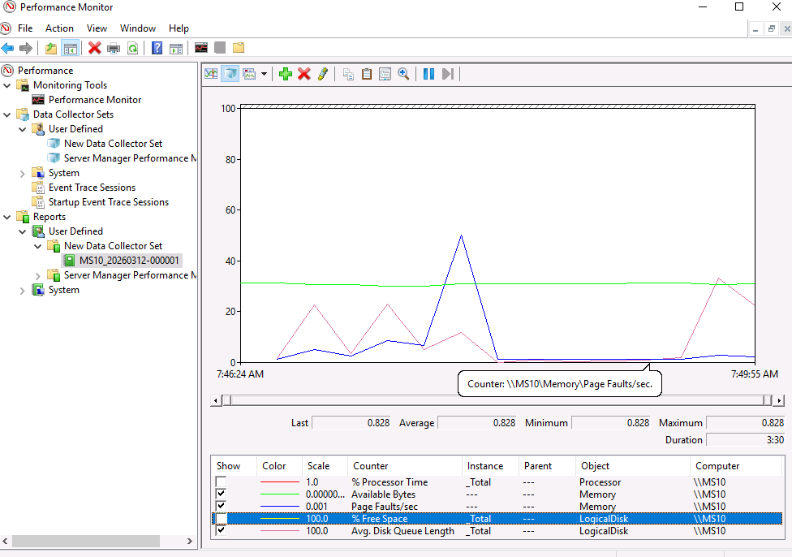

4. **Interpret the counter relationships.** As available bytes drop at the start of the simulated admin activity, page faults and disk queue length spike correspondingly. When the load test begins, both fault rate and queue length remain elevated while available bytes continue to decrease — confirming that disk paging activity is the direct result of memory exhaustion.

---

# Part 2: Monitoring Performance in Linux

Availability monitoring detects unexpected downtime and performance shortfalls relative to service level agreements (SLAs). Linux provides a rich set of both command-line and web-based tools for measuring CPU, memory, and disk utilization.

## Section 5: Monitor Performance in Linux

**Steps:**

1. **Access the Linux host.** Connect to the PC10 VM. Send Ctrl+Alt+Delete and sign in as `Jaime` with the password `Pa$$w0rd`.

2. **Open the Cockpit web console.** Launch a browser and navigate to `http://10.1.16.11:9090`.

3. **Log in.** Authenticate as `smb` with the password `Pa$$w0rd`.

   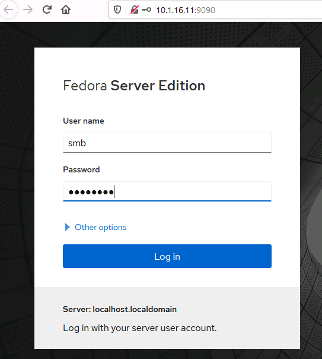

4. **Explore resource details.** Under Usage, select **View details and history**. This console provides a snapshot of compute, storage, and network metrics.

   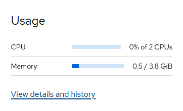

5. **Identify rate-based metrics.** Of the metrics presented in the Cockpit console, identify which two are expressed in units per second:

   - CPU Load
   - **Disk Read/Write** ✓
   - **Network** ✓
   - Memory (RAM)
   - Memory (Swap)

   > **Note:** The two metrics measured per second are **Disk Read/Write** and **Network**.

   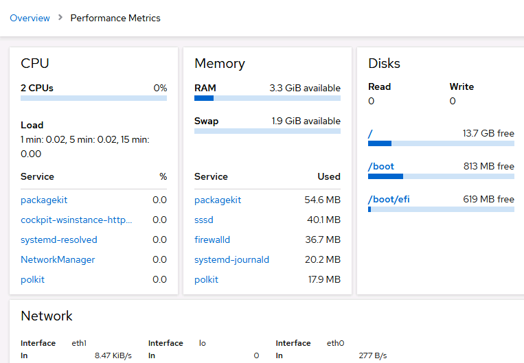

6. **Run the `uptime` command.** Select the **Terminal** node and run:

   ```bash
   uptime
   ```

   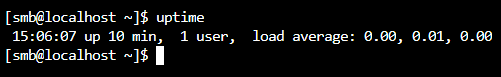

   This command returns system uptime, the number of logged-in users, and the CPU load average for the last 1, 5, and 15 minutes. Any load average value greater than **1** indicates that the CPU was overloaded during that period (processes were queuing for execution time).

7. **Run the `top` command.**

   ```bash
   top
   ```

   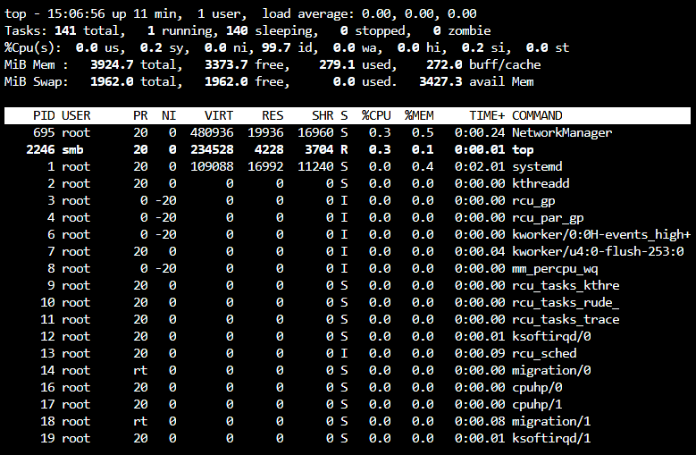

   The `top` command provides a continuously refreshed view of CPU and memory utilization, both in aggregate and per process.

8. **Confirm root runs systemd.** Verify that the `root` user owns the `systemd` process at the top of the process list.

9. **Access field configuration.** Press **`f`** to enter the field management screen, where columns can be added, removed, or reordered.

10. **Exit top.** Press **`q`** twice to quit.

11. **Check block device I/O.** Run `iostat` with the `-m` flag to report statistics in megabytes:

    ```bash
    iostat -m
    ```

    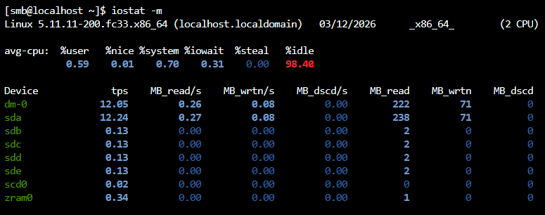

    The first column (`tps`) shows transactions per second. Note that this basic view does not include the average queue length field.

12. **Run extended iostat.** Use the `-x` flag for extended output:

    ```bash
    iostat -x
    ```

    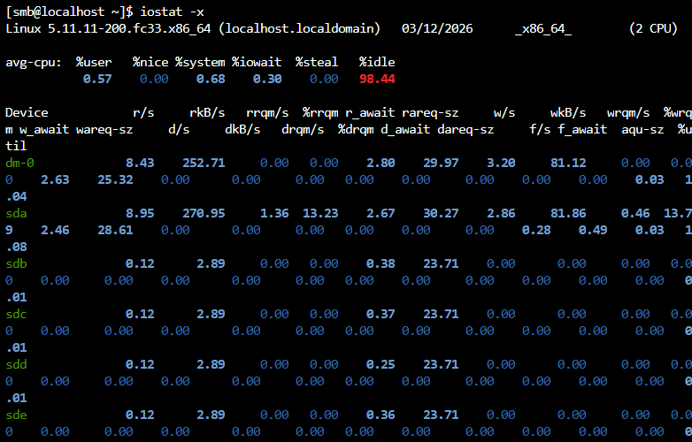

    The extended report includes the average queue length column (`aqu-sz`), though the wide output can be difficult to read in a standard terminal.

13. **Filter iostat output with `awk`.** Run the following command to display only the most relevant columns:

    ```bash
    iostat -dmx -p sda | awk -v OFS='\t' '{print $1, $2, $3, $8, $9, $22}'
    ```

    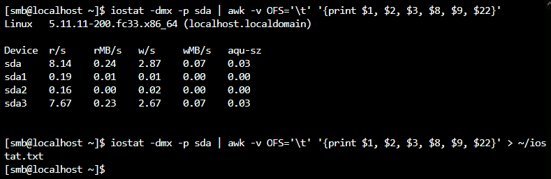

    | Column | Description          |
    |--------|----------------------|
    | `$1`   | Device ID            |
    | `$2`   | Reads/sec            |
    | `$3`   | Read MB/sec          |
    | `$8`   | Writes/sec           |
    | `$9`   | Write MB/sec         |
    | `$22`  | Average queue length (`aqu-sz`) |

    The `-d` flag limits output to the device report, `-p sda` filters by device ID, and `-v OFS='\t'` applies tab separators.

14. **Save iostat output to a file:**

    ```bash
    iostat -dmx -p sda | awk -v OFS='\t' '{print $1, $2, $3, $8, $9, $22}' > ~/iostat.txt
    ```

    The output is redirected to `~/iostat.txt` for later review or comparison.

---

*End of Guide*
